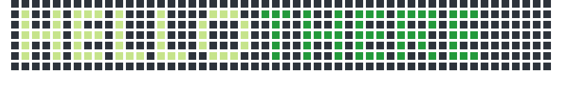
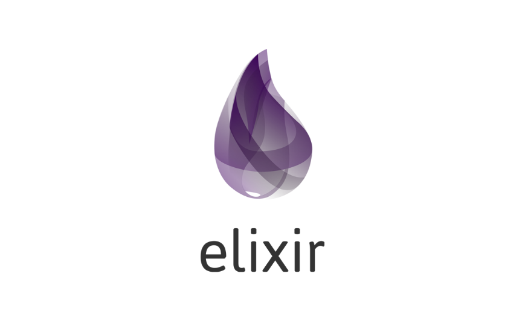

<!-- # Hello there 👋 -->
<!-- README Header -->

(*since 07/12/2022*)

<!-- Programming Languages -->
<h3 align="center" id="languages">

<a href="https://github.com/altar31/github-readme-stats">
</h3>

    <!------>
    
    <!------>
    
    <!------>
    
    <!------>
    
    <!------>

I am currently finishing my PhD in Physics-Chemistry (defend it in couple of months April-May 2023 🎉) in the lab of  [Prof.Dr Frédéric Bernard](https://icb.u-bourgogne.fr/equipe/frederic-bernard/#carriere) at [Excalibure research center](https://icb.u-bourgogne.fr/en/excalibure-center/) within the [University of Burgundy](https://en.u-bourgogne.fr/) and the Diamond grinding tools company [DIAMATEC](http://www.diamatec.fr/en/).

## 👨‍🔬 Research 
My research activities are at the crossroads of computer science, applied mathematics and material science. However, thanks to my research journey, i developped a strong interest in Deep Learning/Machine Learning algorithms development for computer vision and data-driven scientific discoveries.

<!-- - 👀 I’m interested in ...
- 🌱 I’m currently learning ...
- 💞️ I’m looking to collaborate on ...
- 📫 How to reach me ... -->
My main research interests are :
* Neural Architecture Search and High-performance machine learning 
* Deep Learning for computer vision with an emphasis on images segmentation applications
* Energy, carbon footprint and governance of Artificial Intelligence (AI)-based systems
* Field Assisted Sintering Process (Powder Metallurgy)

[You can find my ORCID record](https://orcid.org/0000-0003-1579-2859) and my [researchgate](https://www.researchgate.net/profile/Damien-Sicard)

 <b>Publication History<b> (click to expand)

 

 

<h2 align="center" id="languages">
📫 Contact me
</h2>

    <!------>
    
    <!------>

<!---
altar31/altar31 is a ✨ special ✨ repository because its `README.md` (this file) appears on your GitHub profile.
You can click the Preview link to take a look at your changes.
--->
