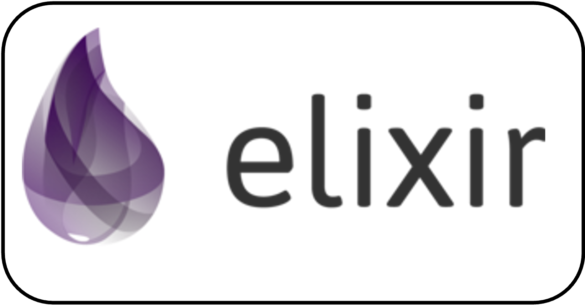

 

<figure>
    
    <figcaption> DeepDream: Do neural networks <a href="https://ai.googleblog.com/2015/06/inceptionism-going-deeper-into-neural.html">dream </a>? [Inceptionism, Google Research 2015]</figcaption>
    
</figure>

<h2 align="center"> 📫 Reach me <h2/>

    <!------>
     
    <!------>
     
    <!------>
    

   
<!-- 
  
    📜 You can find my <a href="Damien_Sicard_resume2023.pdf">resume</a>
 
-->

 ## About me 🧔‍♂️
 
 - PhD in Physics and former energy engineer.
 - I enjoy to build interactive scientific web applications using [Elixir](https://elixir-lang.org/) and the [Phoenix framework](https://www.phoenixframework.org/).
 - I'm a cookery enthusiast, runner and traveler.
 - I have an amazing wife and two cats. 

## 👨‍🔬 Science

My main research interests are :
* Numerical Simulation of Powder Metallurgy Process,
* Physics-Informed Machine Learning,
* Applications of Machine Learning/Deep Learning algorithms in Materials science and Engineering.

<h3 align="center" id="languages">

<a href="https://github.com/altar31/github-readme-stats">
<!-- Programming Languages -->

</h3>

    <!------> 
    
    

     

 
 
  Visitors count 
  

    
  
